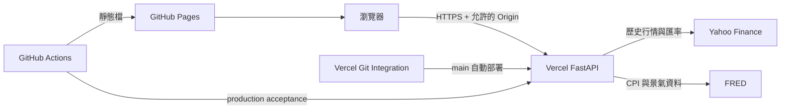

# 系統架構

本專案採「靜態前端＋無伺服器 API」架構。GitHub Pages 不執行 Python，因此 `yfinance` 與回測引擎部署在 Vercel Hobby Python Function；瀏覽器只負責模型設定、呼叫 API 與結果視覺化。

## 元件責任

| 元件 | 技術 | 責任 |
|---|---|---|
| Web | React、TypeScript、Vite、Recharts | 設定模型、代碼搜尋、圖表、匯出、分享連結、重新整理空白重置 |
| API | FastAPI、Pydantic | 驗證請求、Origin／可選 API key 保護、速率限制、錯誤轉譯 |
| 資料層 | yfinance、FRED、Kenneth French Data Library | 行情、股息、匯率、CPI、因子資料 |
| 計算層 | pandas、NumPy | 現金流、再平衡、槓桿、績效與風險分析 |
| 發布 | GitHub Pages、Actions、Vercel Hobby | 零月租託管、自動測試與部署 |

## 資料流程

1. Web 將最多五組有效投資組合正規化成 JSON 請求；空白或 0% 的組合不會送出。
2. API 把純數字台股代碼轉為 `.TW`，並取得所有資產與基準資料。
3. 讀取 Yahoo 的實際報價幣別，以資產日與匯率日聯集逐日換算為 TWD，再取共同可用期間。
4. 計算層逐日處理台幣報酬、股息、外部現金流、借款利息、再平衡及交易成本。
5. API 回傳時間序列、年度／月度報酬、績效指標及選用的進階分析。
6. Web 產生互動圖表、表格及 CSV／JSON 下載；模型只在當前頁面或使用者主動建立的分享網址中。

## 安全邊界

- GitHub Pages 是公開靜態網站，不包含秘密。
- Vercel production 自動視為 production，正式環境關閉 OpenAPI 文件。
- 預設不需要環境變數；未設定 `BACKTEST_API_KEY` 時，`/api/v1/*` 只接受允許清單中的瀏覽器 `Origin`。
- 預設允許 `http://localhost:5173` 與 `https://chihung1024.github.io`；無 Origin 或其他來源回傳 `403`。
- 若日後設定 `BACKTEST_API_KEY`，API 會改以 `X-Backtest-Key` 驗證，保留私人模式相容性。
- 一般 API 每來源 IP 每分鐘 20 次，回測端點另外限制每分鐘 4 次；多執行個體時限制各自計算。
- API 回應加上 `nosniff`、Referrer Policy、Permissions Policy 與 `Cache-Control: no-store`。
- 這是個人研究架構，不適合作為多人付費服務；若要公開給大量使用者，需改用正式身分驗證、集中式限流與授權資料源。

## 可用性與成本取捨

- Vercel Functions 會有冷啟動；第一次請求可能較慢。
- yfinance 快取位於單一程序記憶體中，執行個體終止時可以消失；快取只影響速度，不影響正確性。
- Vercel Hobby 超過免費用量時服務可能受限，但本架構不再連結 Google Cloud 計費資源。
- Web 模型不寫入 `localStorage`，一般重新整理會回到桌機五組／手機兩組的空白預設；API 連線、語言與佈景仍保存在本機瀏覽器，不需要資料庫。
