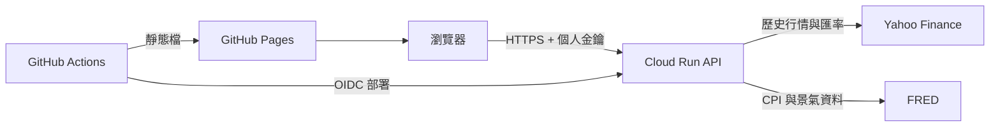

# 系統架構

本專案採「靜態前端＋無伺服器 API」架構。GitHub Pages 不執行 Python，因此 `yfinance` 與回測引擎部署在 Google Cloud Run；瀏覽器只負責模型設定、呼叫 API 與結果視覺化。

## 元件責任

| 元件 | 技術 | 責任 |
|---|---|---|
| Web | React、TypeScript、Vite、Recharts | 設定模型、代碼搜尋、圖表、匯出、分享連結、本機保存 |
| API | FastAPI、Pydantic | 驗證請求、金鑰保護、速率限制、錯誤轉譯 |
| 資料層 | yfinance、FRED、Kenneth French Data Library | 行情、股息、匯率、CPI、因子資料 |
| 計算層 | pandas、NumPy | 現金流、再平衡、槓桿、績效與風險分析 |
| 發布 | GitHub Pages、Actions、Cloud Run | 免費或低成本託管、自動測試與部署 |

## 資料流程

1. Web 將最多三組投資組合正規化成 JSON 請求。
2. API 把純數字台股代碼轉為 `.TW`，並取得所有資產與基準資料。
3. 不同幣別先以 Yahoo Finance 匯率換成同一基準幣別，再取共同可用期間。
4. 計算層逐交易日處理報酬、股息、外部現金流、借款利息、再平衡及交易成本。
5. API 回傳時間序列、年度／月度報酬、績效指標及選用的進階分析。
6. Web 產生互動圖表、表格及 CSV／JSON 下載；模型與 API 金鑰只保留在使用者瀏覽器。

## 安全邊界

- GitHub Pages 是公開靜態網站，不包含 API 金鑰。
- Cloud Run 必須允許瀏覽器連線，但 FastAPI 會以 `X-Backtest-Key` 再做應用層授權。
- Cloud Run 僅接受設定的 CORS origin；預設為本機與 `https://chihung1024.github.io`。
- GitHub Actions 透過短效 OIDC 憑證部署，不保存 Google Cloud JSON 私鑰。
- API 有每來源 IP 每分鐘 30 次的記憶體內速率限制；多執行個體時限制各自計算。
- 這是個人研究架構，不適合作為多人付費服務；若要公開給大量使用者，需改用正式身分驗證、集中式限流與授權資料源。

## 可用性與成本取捨

- Cloud Run `min-instances=0` 可壓低閒置成本，但冷啟動會讓第一次請求較慢。
- yfinance 快取位於單一程序記憶體中，執行個體終止時可以消失；快取只影響速度，不影響正確性。
- Web 模型使用 `localStorage`，不需要資料庫；清除瀏覽器資料會移除本機模型與連線設定。
